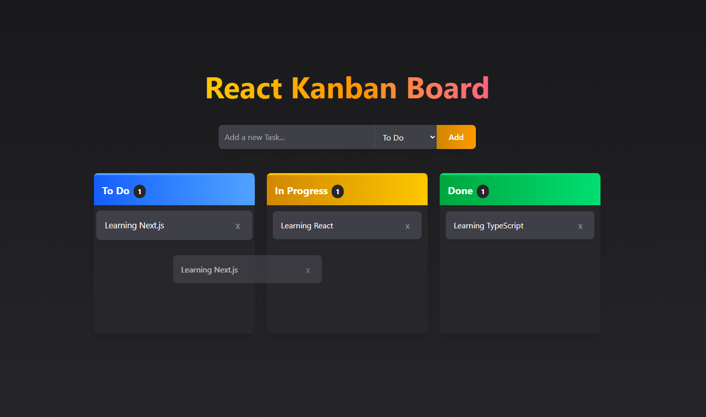

# 🧩 React Kanban Board

A simple and beautiful Kanban board built with **React** and **TypeScript**. It allows you to manage tasks across multiple columns with drag-and-drop functionality and persists data using **localStorage**.

## 🚀 Features

- ✅ **Add new tasks to any column "To Do" | "In Progress" | "Done"** 
- ✏️ **Remove tasks** 
- 🔁 **Drag and drop tasks between columns** 
- 💾 **Saves tasks automatically in localStorage** 
- 🎨 **Responsive and modern UI using Tailwind CSS** 

## 🛠️ Tech Stack

- **React** – UI Library  
- **TypeScript** – Type safety and scalability  
- **Vite** – Fast and modern build tool  
- **Tailwind CSS** – Utility-first styling  
- **localStorage** - Persists data

## 📸 Preview



## 🚀 Live Demo

[🔗 View Live Demo](https://kanban-board15.netlify.app)

## 📦 Installation

1. **Clone the repo:**
   ```bash
   git clone https://github.com/ahmedragab15/React-Kanban-Board
   cd kanban-board

2. **Install dependencies:**
    ```bash
    npm install

3. **Run the app locally:**
    ```bash
    npm run dev